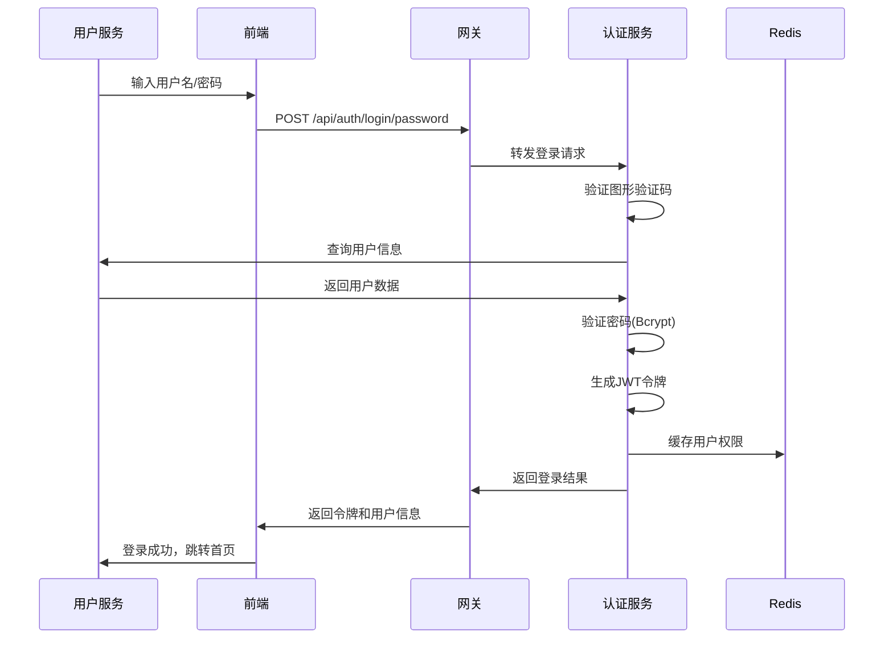
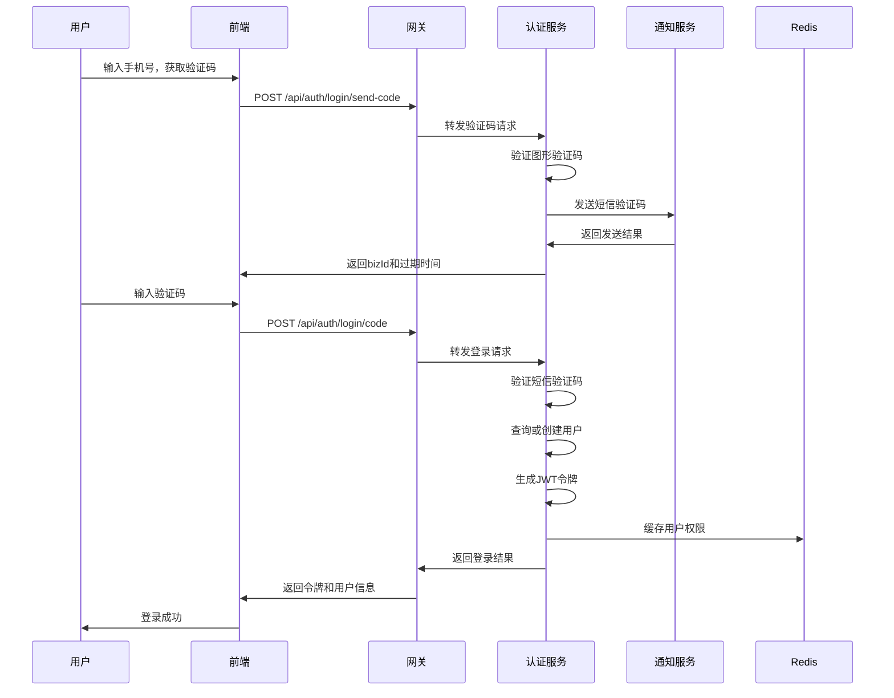
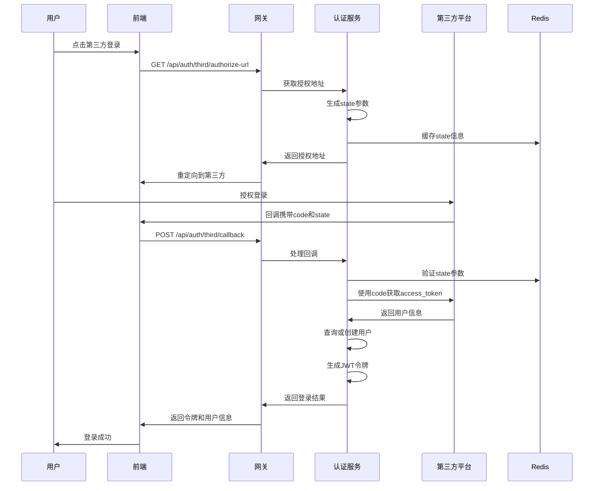

# 多方式登录实现方案

## 1. 登录方式概述

### 1.1 支持的登录方式
- **账号密码登录**: 用户名/密码登录
- **手机号密码登录**: 手机号+密码登录
- **邮箱密码登录**: 邮箱+密码登录
- **手机号验证码登录**: 手机号+短信验证码登录
- **第三方社交登录**: 微信扫码、微信快捷登录、QQ、支付宝、GitHub等

### 1.2 登录流程对比

| 登录方式 | 认证方式 | 安全性 | 用户体验 | 适用场景 |
|---------|---------|--------|----------|----------|
| 账号密码 | 密码认证 | 中等 | 传统 | 企业用户、管理员 |
| 手机号密码 | 密码认证 | 中等 | 便捷 | 移动端用户 |
| 邮箱密码 | 密码认证 | 中等 | 便捷 | 办公用户 |
| 手机验证码 | 验证码认证 | 高 | 极佳 | 移动端、安全要求高 |
| 第三方登录 | OAuth2.0 | 高 | 最佳 | 快速注册、社交应用 |

## 2. 数据库设计增强

### 2.1 用户表增强字段
```sql
-- 用户表新增字段
ALTER TABLE sys_user ADD COLUMN user_type TINYINT DEFAULT 1 COMMENT '用户类型：1-普通用户，2-第三方用户';

-- 添加唯一索引
ALTER TABLE sys_user ADD UNIQUE KEY uk_tenant_phone (tenant_id, phone);
```

### 2.2 第三方认证表
```sql
CREATE TABLE sys_user_third_auth (
    id BIGINT PRIMARY KEY AUTO_INCREMENT COMMENT '主键ID',
    tenant_id BIGINT NOT NULL COMMENT '租户ID',
    user_id BIGINT NOT NULL COMMENT '用户ID',
    third_type VARCHAR(20) NOT NULL COMMENT '第三方类型：WECHAT/QQ/ALIPAY/GITHUB',
    third_id VARCHAR(128) NOT NULL COMMENT '第三方用户唯一标识',
    third_union_id VARCHAR(128) COMMENT '第三方UnionID（微信专用）',
    third_nickname VARCHAR(128) COMMENT '第三方昵称',
    third_avatar VARCHAR(500) COMMENT '第三方头像',
    access_token VARCHAR(500) COMMENT '访问令牌',
    refresh_token VARCHAR(500) COMMENT '刷新令牌',
    expire_time DATETIME COMMENT '令牌过期时间',
    bind_time DATETIME DEFAULT CURRENT_TIMESTAMP COMMENT '绑定时间',
    status TINYINT DEFAULT 1 COMMENT '状态：0-解绑，1-绑定',
    created_time DATETIME DEFAULT CURRENT_TIMESTAMP COMMENT '创建时间',
    updated_time DATETIME DEFAULT CURRENT_TIMESTAMP ON UPDATE CURRENT_TIMESTAMP COMMENT '更新时间'
);
```

### 2.3 验证码表
```sql
CREATE TABLE sys_verification_code (
    id BIGINT PRIMARY KEY AUTO_INCREMENT COMMENT '验证码ID',
    tenant_id BIGINT NOT NULL COMMENT '租户ID',
    receiver VARCHAR(128) NOT NULL COMMENT '接收者（手机号/邮箱）',
    code_type VARCHAR(20) NOT NULL COMMENT '验证码类型：LOGIN/REGISTER/RESET_PASSWORD/BIND_PHONE/BIND_EMAIL',
    code VARCHAR(20) NOT NULL COMMENT '验证码',
    biz_id VARCHAR(128) COMMENT '业务ID（短信服务商返回）',
    expire_time DATETIME NOT NULL COMMENT '过期时间',
    used TINYINT DEFAULT 0 COMMENT '是否已使用：0-未使用，1-已使用',
    used_time DATETIME COMMENT '使用时间',
    ip_address VARCHAR(64) COMMENT '请求IP',
    send_status TINYINT DEFAULT 1 COMMENT '发送状态：0-失败，1-成功',
    send_time DATETIME DEFAULT CURRENT_TIMESTAMP COMMENT '发送时间',
    created_time DATETIME DEFAULT CURRENT_TIMESTAMP COMMENT '创建时间'
);
```

## 3. 登录流程设计

### 3.1 账号密码登录流程


### 3.2 手机号验证码登录流程


### 3.3 第三方登录流程


## 4. 安全设计

### 4.1 密码安全
- **密码加密**: 使用BCrypt加密存储
- **密码强度**: 前端验证密码复杂度
- **密码策略**: 定期强制修改密码
- **登录失败限制**: 连续失败锁定账户

### 4.2 验证码安全
- **图形验证码**: 防止暴力破解
- **短信验证码**: 频率限制和过期时间
- **验证码复杂度**: 6位数字或字母数字混合
- **防重放攻击**: 验证码一次性使用

### 4.3 第三方登录安全
- **State参数**: 防止CSRF攻击
- **Token验证**: 验证第三方返回的token
- **用户信息验证**: 验证第三方用户信息的完整性
- **绑定确认**: 重要操作需要二次确认

### 4.4 会话安全
- **JWT令牌**: 无状态会话管理
- **令牌刷新**: 自动刷新访问令牌
- **令牌撤销**: 支持主动撤销令牌
- **设备管理**: 多设备登录管理

## 5. 技术实现

### 5.1 认证服务增强

#### 5.1.1 登录策略接口
```java
public interface LoginStrategy {
    /**
     * 登录类型
     */
    LoginType getLoginType();
    
    /**
     * 验证登录参数
     */
    void validate(LoginRequest request);
    
    /**
     * 执行登录
     */
    LoginResult login(LoginRequest request);
}
```

#### 5.1.2 登录策略实现
- `UsernamePasswordLoginStrategy`: 用户名密码登录
- `PhonePasswordLoginStrategy`: 手机号密码登录
- `EmailPasswordLoginStrategy`: 邮箱密码登录
- `PhoneCodeLoginStrategy`: 手机验证码登录
- `ThirdPartyLoginStrategy`: 第三方登录

### 5.2 验证码服务

#### 5.2.1 验证码生成
```java
@Service
public class VerificationCodeService {
    
    /**
     * 生成图形验证码
     */
    public CaptchaResult generateCaptcha() {
        // 生成验证码图片和答案
        // 存储到Redis，设置过期时间
        // 返回验证码ID和图片Base64
    }
    
    /**
     * 发送短信验证码
     */
    public SmsSendResult sendSmsCode(String phone, CodeType codeType) {
        // 频率限制检查
        // 生成验证码
        // 调用短信服务发送
        // 存储验证码记录
    }
    
    /**
     * 验证验证码
     */
    public boolean verifyCode(String receiver, String code, CodeType codeType) {
        // 查询验证码记录
        // 检查是否过期
        // 检查是否已使用
        // 标记为已使用
    }
}
```

### 5.3 第三方登录集成

#### 5.3.1 第三方登录工厂
```java
@Service
public class ThirdPartyLoginFactory {
    
    /**
     * 获取第三方登录处理器
     */
    public ThirdPartyLoginHandler getHandler(ThirdPartyType type) {
        switch (type) {
            case WECHAT:
                return new WeChatLoginHandler();
            case QQ:
                return new QQLoginHandler();
            case ALIPAY:
                return new AlipayLoginHandler();
            case GITHUB:
                return new GitHubLoginHandler();
            default:
                throw new BusinessException("不支持的第三方登录类型");
        }
    }
}
```

#### 5.3.2 微信登录实现
```java
@Component
public class WeChatLoginHandler implements ThirdPartyLoginHandler {
    
    @Override
    public String getAuthorizeUrl(String redirectUri, String state) {
        // 构建微信OAuth2.0授权地址
        return String.format(
            "https://open.weixin.qq.com/connect/qrconnect?appid=%s&redirect_uri=%s&response_type=code&scope=snsapi_login&state=%s",
            appId, URLEncoder.encode(redirectUri), state
        );
    }
    
    @Override
    public ThirdPartyUserInfo getUserInfo(String code) {
        // 使用code获取access_token
        // 使用access_token获取用户信息
        // 返回标准化用户信息
    }
}
```

## 6. 前端实现

### 6.1 登录页面组件

#### 6.1.1 多Tab登录界面
```vue
<template>
  <div class="login-container">
    <el-tabs v-model="activeTab">
      <el-tab-pane label="账号登录" name="password">
        <PasswordLogin @success="onLoginSuccess" />
      </el-tab-pane>
      <el-tab-pane label="手机验证码登录" name="code">
        <CodeLogin @success="onLoginSuccess" />
      </el-tab-pane>
    </el-tabs>
    
    <!-- 第三方登录 -->
    <div class="third-login">
      <div class="divider">其他登录方式</div>
      <div class="third-buttons">
        <el-button @click="wechatLogin" class="wechat-btn">
          <i class="icon-wechat"></i> 微信登录
        </el-button>
        <el-button @click="qqLogin" class="qq-btn">
          <i class="icon-qq"></i> QQ登录
        </el-button>
      </div>
    </div>
  </div>
</template>
```

#### 6.1.2 密码登录组件
```vue
<template>
  <el-form :model="form" :rules="rules" ref="loginForm">
    <el-form-item prop="loginType">
      <el-radio-group v-model="form.loginType">
        <el-radio label="USERNAME">用户名</el-radio>
        <el-radio label="PHONE">手机号</el-radio>
        <el-radio label="EMAIL">邮箱</el-radio>
      </el-radio-group>
    </el-form-item>
    
    <el-form-item prop="username" v-if="form.loginType === 'USERNAME'">
      <el-input v-model="form.username" placeholder="请输入用户名" />
    </el-form-item>
    
    <el-form-item prop="phone" v-if="form.loginType === 'PHONE'">
      <el-input v-model="form.phone" placeholder="请输入手机号" />
    </el-form-item>
    
    <el-form-item prop="email" v-if="form.loginType === 'EMAIL'">
      <el-input v-model="form.email" placeholder="请输入邮箱" />
    </el-form-item>
    
    <el-form-item prop="password">
      <el-input type="password" v-model="form.password" placeholder="请输入密码" />
    </el-form-item>
    
    <el-form-item prop="captcha">
      <div class="captcha-container">
        <el-input v-model="form.captcha" placeholder="请输入验证码" />
        
      </div>
    </el-form-item>
    
    <el-button type="primary" @click="handleLogin" :loading="loading">
      登录
    </el-button>
  </el-form>
</template>
```

#### 6.1.3 验证码登录组件
```vue
<template>
  <el-form :model="form" :rules="rules" ref="codeForm">
    <el-form-item prop="phone">
      <el-input v-model="form.phone" placeholder="请输入手机号" />
    </el-form-item>
    
    <el-form-item prop="code">
      <div class="code-container">
        <el-input v-model="form.code" placeholder="请输入验证码" />
        <el-button 
          :disabled="countdown > 0" 
          @click="sendCode" 
          class="send-btn"
        >
          {{ countdown > 0 ? `${countdown}s后重试` : '获取验证码' }}
        </el-button>
      </div>
    </el-form-item>
    
    <el-button type="primary" @click="handleLogin" :loading="loading">
      登录
    </el-button>
  </el-form>
</template>

<script>
export default {
  data() {
    return {
      form: {
        phone: '',
        code: ''
      },
      countdown: 0,
      loading: false
    }
  },
  
  methods: {
    async sendCode() {
      // 发送验证码逻辑
      this.countdown = 60
      const timer = setInterval(() => {
        this.countdown--
        if (this.countdown <= 0) {
          clearInterval(timer)
        }
      }, 1000)
    }
  }
}
</script>
```

## 7. 配置管理

### 7.1 第三方登录配置
```yaml
# application-third.yml
third-party:
  wechat:
    app-id: ${WECHAT_APP_ID}
    app-secret: ${WECHAT_APP_SECRET}
    redirect-uri: ${WECHAT_REDIRECT_URI}
    enabled: true
    
  qq:
    app-id: ${QQ_APP_ID}
    app-key: ${QQ_APP_KEY}
    redirect-uri: ${QQ_REDIRECT_URI}
    enabled: true
    
  alipay:
    app-id: ${ALIPAY_APP_ID}
    private-key: ${ALIPAY_PRIVATE_KEY}
    public-key: ${ALIPAY_PUBLIC_KEY}
    redirect-uri: ${ALIPAY_REDIRECT_URI}
    enabled: true
```

### 7.2 验证码配置
```yaml
# application-code.yml
verification-code:
  # 图形验证码配置
  captcha:
    width: 120
    height: 40
    length: 4
    expire-seconds: 300
    
  # 短信验证码配置
  sms:
    length: 6
    expire-seconds: 300
    daily-limit: 10
    ip-daily-limit: 50
    
  # 邮箱验证码配置
  email:
    length: 6
    expire-seconds: 600
    daily-limit: 20
```

## 8. 监控和日志

### 8.1 登录统计
- 各登录方式的使用频率
- 登录成功率统计
- 登录失败原因分析
- 用户活跃度统计

### 8.2 安全监控
- 异常登录行为检测
- 暴力破解尝试监控
- 第三方登录异常监控
- 验证码滥用检测

### 8.3 操作日志
- 登录成功/失败记录
- 验证码发送记录
- 第三方登录记录
- 账号绑定/解绑记录

## 9. 测试方案

### 9.1 单元测试
- 登录策略测试
- 验证码服务测试
- 第三方登录集成测试

### 9.2 集成测试
- 端到端登录流程测试
- 第三方登录回调测试
- 多设备登录测试

### 9.3 安全测试
- 密码安全测试
- 验证码安全测试
- 第三方登录安全测试
- 会话安全测试

## 10. 部署和运维

### 10.1 环境配置
- 第三方应用配置
- 短信服务配置
- 邮件服务配置
- Redis缓存配置

### 10.2 监控告警
- 登录服务健康监控
- 第三方服务可用性监控
- 验证码服务性能监控

### 10.3 故障处理
- 第三方服务故障处理
- 验证码服务故障处理
- 登录服务降级方案

这套多方式登录方案提供了完整的登录体验，支持多种登录方式，确保了系统的安全性和用户体验。